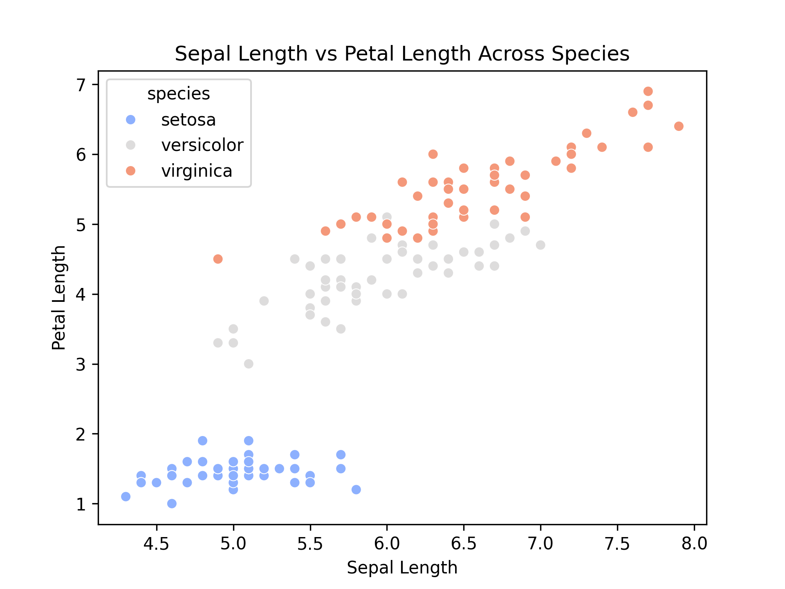
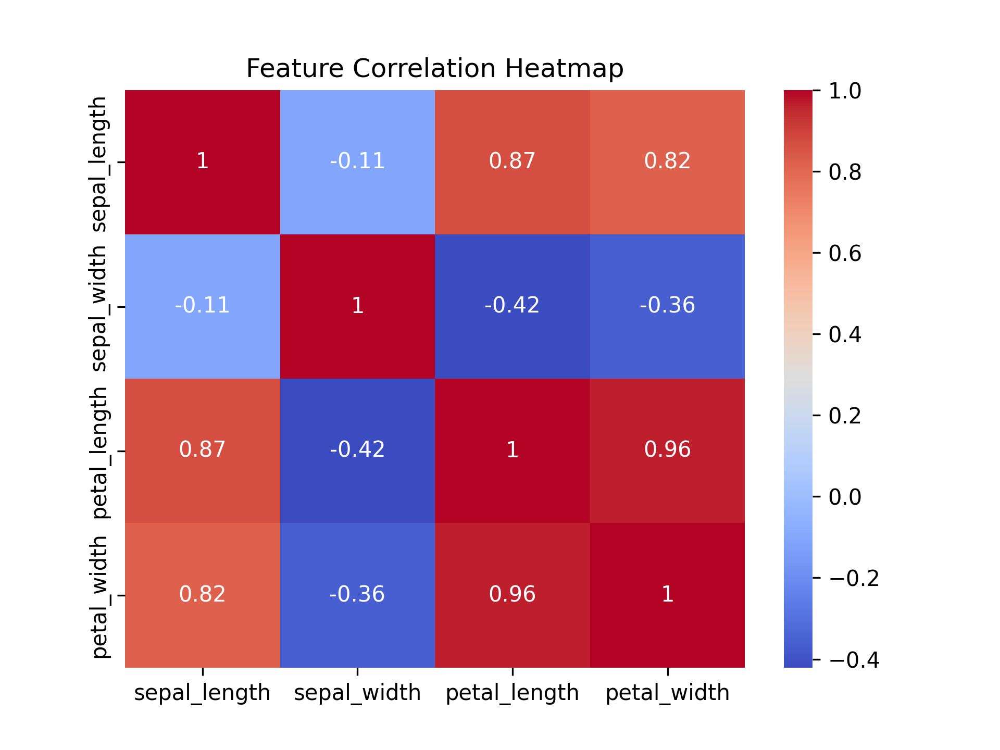

# iris-analysis
# 📊 Iris Dataset Analysis - Codveda Internship

## 🏆 Project Overview
This repository contains my **data analysis project** for the Codveda internship. The focus is on cleaning, exploring, and visualizing the **Iris dataset**, which consists of flower measurements across three species.

### 🔹 Tasks Completed
✅ **Data Cleaning & Preprocessing**  
- Handled missing values, duplicates, and standardized categorical data.  
- Converted species names into numerical labels using `LabelEncoder`.  

✅ **Exploratory Data Analysis (EDA)**  
- Computed summary statistics (Mean, Median, Mode, Standard Deviation).  
- Visualized distributions using histograms, boxplots, and scatter plots.  

✅ **Basic Data Visualization**  
- Created bar plots, line charts, scatter plots, and heatmaps using `Matplotlib` and `Seaborn`.  
- Customized labels, titles, and legends for clarity.  
- Exported visualizations as images for reports.  

---

## 🚀 Technologies Used
- **Python** 🐍  
- **Pandas** for data manipulation  
- **Seaborn & Matplotlib** for data visualization  
- **Scikit-learn** for encoding categorical variables  

---

## 📂 Repository Structure
── 📜 README.md (Project Overview & Instructions)
── 📊 iris_data_analysis.ipynb (Jupyter Notebook with Code)
── 📈 visualizations/ (Exported plots & images)
── 📄 dataset.csv (Cleaned dataset used for analysis)


---

## 📊 Sample Visualizations
Here are some key **data visualizations** generated during analysis:

### 🔹 Species Distribution


### 🔹 Sepal vs Petal Length Relationship


### 🔹 Feature Correlations


---

## ✨ How to Run This Project
1️⃣ Clone this repository:  
   ```bash

🔗 Final Submission Links
GitHub Repository: https://github.com/Evecandy/iris-analysis

LinkedIn Post: My LinkedIn Project Post

Codveda Internship Video Explanation: My Video Link

💡 Feel free to contribute, suggest improvements, or fork this repository!
